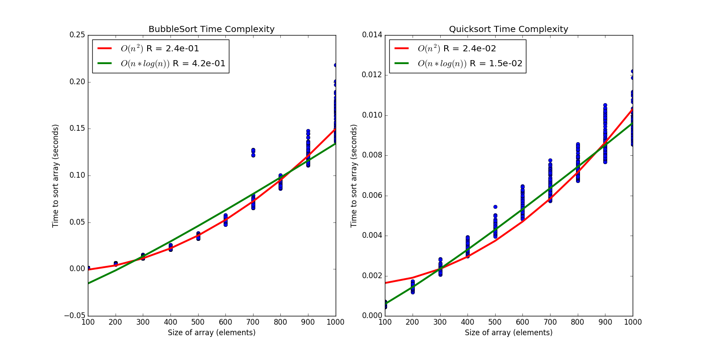

# BMI 203 - HW 1

[](https://travis-ci.org/david-joy/bmi203-hw1)

David Joy
1/24/2017

## Implement BubbleSort and Quicksort for integers

BubbleSort is implemented in `algs.bubblesort()`
Quicksort is implemented in `algs.quicksort()`, with auxilary functions `algs._quicksort()` and `algs._quicksort_partition()`

* Count the number of assignments
    * BubbleSort:
        * `(n outer loops) * (n-1 + n-2 + ... 1 inner loops) * (2 assignments worst case)`
        * `n * (n - 1)/2 * 2 = n**2 + n`
        * `O(n**2)` assignments
    * Quicksort:
        * `(r - p swaps per partition worst case)`
        * p starts at 0, so `r - p = n`
        * `O(n)` total assignments
* Count the number of conditionals
    * BubbleSort:
        * `(n outer loops) * (n-1 + n-2 + ... 1 inner loops) * (2 compares)`
        * `n * (n - 1)/2 * 2 = n**2 + n`
        * `O(n**2)` conditionals
    * Quicksort:
        * `(r - p compares per partion)`
        * p starts at 0, so `r - p = n`
        * Average case:
            * A random partition splits the array into equal pieces. We recurse `O(log(n))` times.
            * Total conditions `O(n*log(n))`
        * Worst case:
            * A bad partition splits the array into splits of size 1, n - 1. We recurse `O(n)` times.
            * Total conditions `O(n**2)`

## Test some typical edge cases for sorting and run them on Travis

All tests are implemented in `test/test_algs.py`

Some cases to think of:

* Empty vector - `test_bubblesort_zero_elements()`
* Single element vector - `test_bubblesort_one_element()`
* Duplicated elements - `test_bubblesort_many_elements()`
* Odd vs even length of input vector - `test_bubblesort_many_elements_even()`

Tests for quicksort are also provided with the same naming convention.

## Test the time complexity of your algorithms as follows:

* For sizes of 100, 200, 300, ... 1000 
* Generate 100 random vectors 
* Sort them using your code

To run the sorting simulation, do `python plot_time_complexity.py`

The output plot is written to `images/time_complexity.png`



Fitting `O(n**2)` and `O(n log(n))` to each data set, BubbleSort most closely fits `O(n**2)` while Quicksort most closely fits `O(n log(n))` on average.

## Installing

To use the package, first run

```
conda install --yes --file requirements.txt
```

to install all the dependencies in `requirements.txt`. Then the package's
main function (located in `hw1/__main__.py`) can be run as follows

```
python -m hw1
```

## Testing

Testing is as simple as running

```
python -m pytest
```

from the root directory of this project.
